# Reviewer Gigm 

## [Q2.5] Explanation Samples

Explanation Samples from UCR repository datasets for better illustration

---

## Arrowhead Dataset

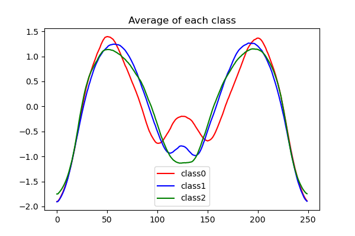

**Average of test samples in each class**

The above figure represents the average of all test samples in each class of the Arrowhead dataset. This figure is provided as reference for the example explanation samples given below.   

---

## Class 1 Explanation Sample 69

  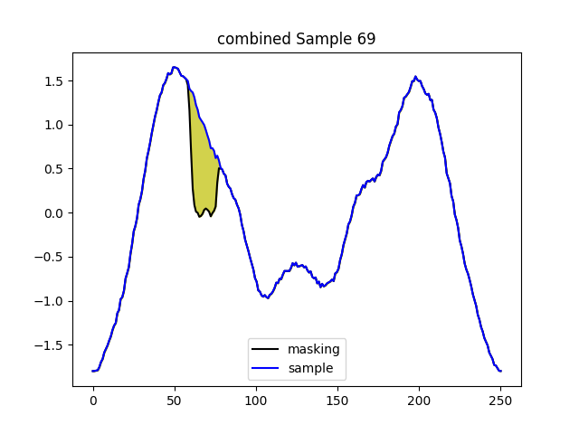
  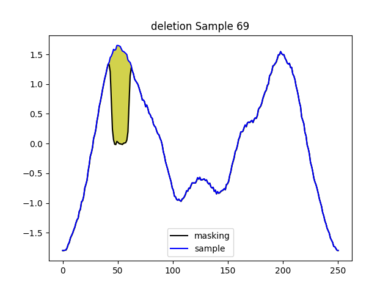
  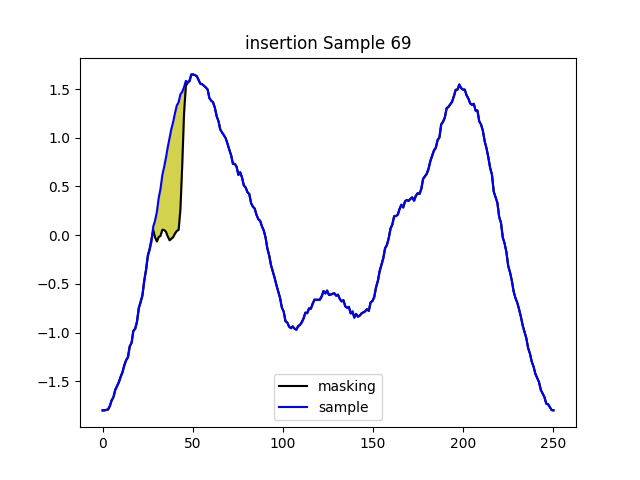
  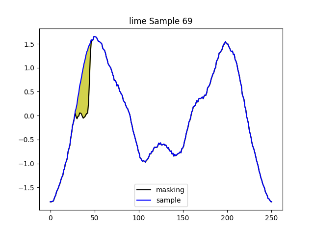
  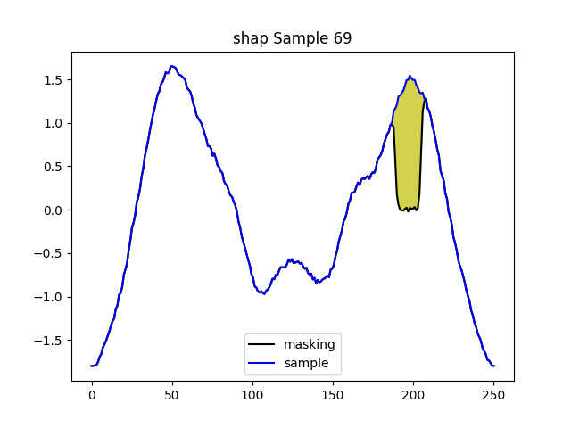
  

### Sample Explanation  

As denoted in the legend of each figure, **sample** represents the explanation sample and **masking** represents the inverse-STFT reconstructed signal after masking the most important feature from the time-frequency domain spectrogram. The most important feature is determined by each perturbation-based model stated in the title of each figure. The yellow-region represents the difference between the explanation sample and the masked reconstructed signal, which visualizes the effect of the important time-frequency feature.       

### Explanation Sample Comparison  

Although the average of each class does not indicate definite ground-truth important regions, a good class-specific explanation can be inferred by the distance between the class being explained to all other classes in the pinpointed region. Of the six different explanation figures above, the highlighted region of the combined method has the most distinct Class 1 region when referring to the average of each class. 

## Class 2 Explanation Sample 122

  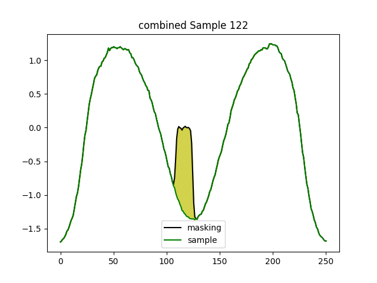
  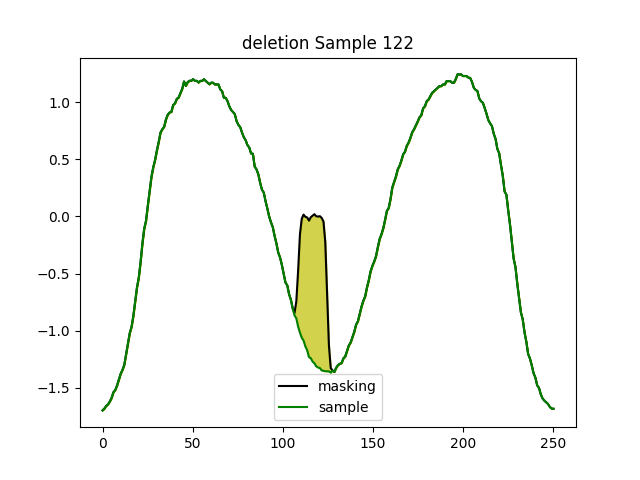
  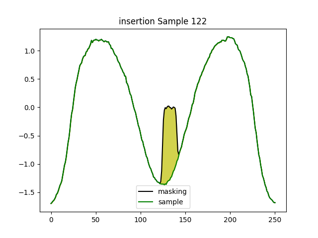
  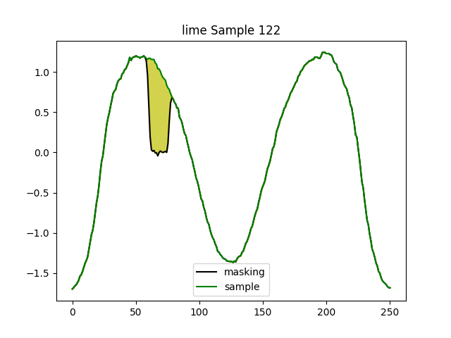
  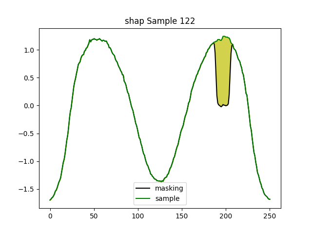
  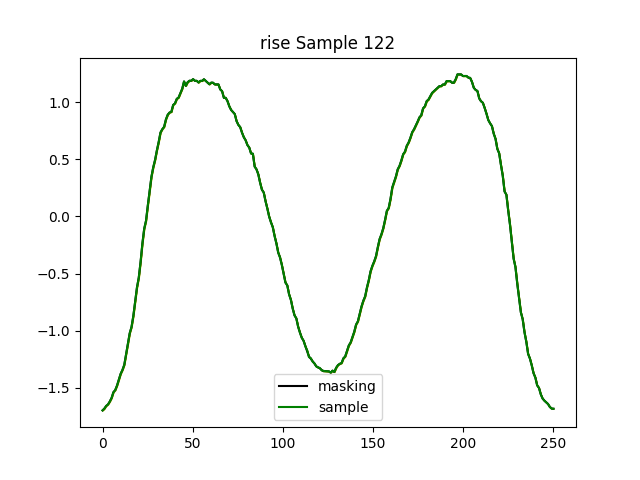

### Explanation Sample Comparison  

Similarly, the important region of the combined method has the most distinct Class 2 region when referring to the average of each class.

---

## Conclusion

Summarize the purpose of your image samples and their explanations here.

---

## How to Contribute

(If applicable) Provide instructions for how others can contribute to your project.

---

## Contact Information

(If applicable) Provide your contact information or instructions on how best to reach you.
