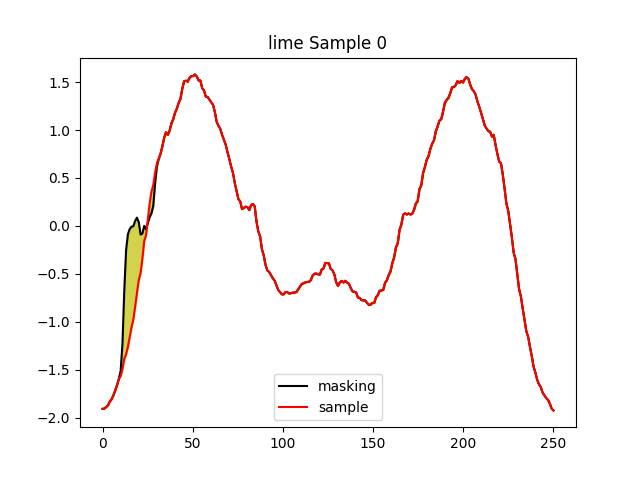
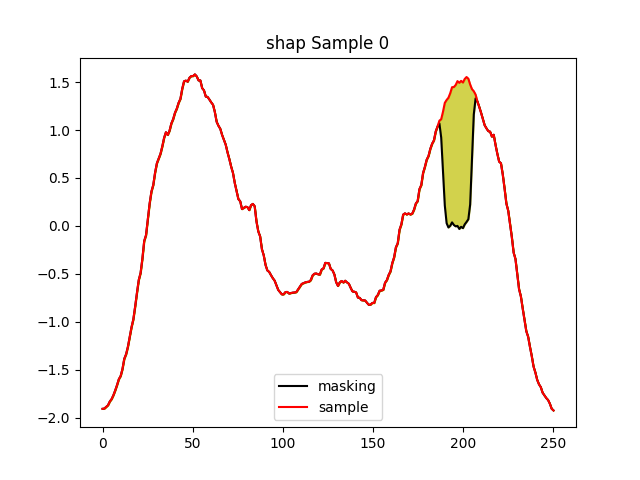
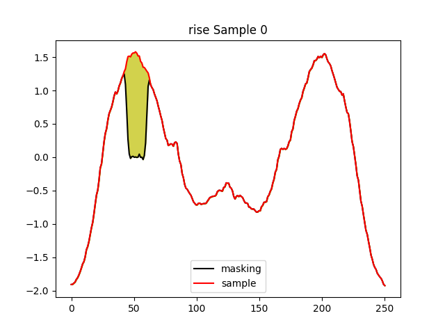

# Title of Your Project

## Introduction

Provide a brief introduction to your project here. Explain the purpose of the image samples and their corresponding explanations.

---

## Image Sample

**Explanation for Your Main Image:**

Here, write a detailed explanation for your main image. Explain what it represents, any specific details viewers should notice, and how it relates to your project or rebuttal.

---

## Comparative Image Samples

  
  
  
  

### Explanations for Comparative Images

**Image 1 Explanation:**

- Explanation for Image 1 here...

**Image 2 Explanation:**

- Explanation for Image 2 here...

**Image 3 Explanation:**

- Explanation for Image 3 here...

**Image 4 Explanation:**

- Explanation for Image 4 here...

---

## Conclusion

Summarize the purpose of your image samples and their explanations here.

---

## How to Contribute

(If applicable) Provide instructions for how others can contribute to your project.

---

## Contact Information

(If applicable) Provide your contact information or instructions on how best to reach you.
