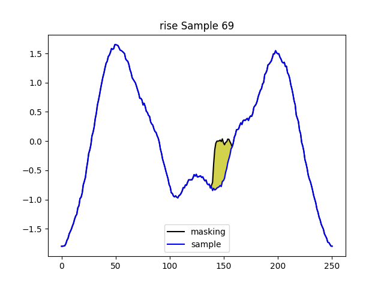

# Reviewer Gigm 

## [Q2.5] Explanation Samples

Explanation Samples from UCR repository datasets for better illustration

---

## Arrowhead Dataset

**Average of test samples in each class**

The above figure represents the average of all test samples in each class of the Arrowhead dataset. This figure is provided as reference for the example explanation samples given below.   

---

## Class 1 Explanation Sample 69

  
  
  
  
  
  

### Sample Explanation  

As denoted in the legend of each figure, **sample** represents the explanation sample and **masking** represents the inverse-STFT reconstructed signal after masking the most important feature from the time-frequency domain spectrogram. The most important feature is determined by each perturbation-based model stated in the title of each figure. The yellow-region represents the difference between the explanation sample and the masked reconstructed signal, which visualizes the effect of the important time-frequency feature.       

### Explanation Sample Comparison  

Although the average of each class does not indicate definite ground-truth important regions, a good class-specific explanation can be inferred by the distance between the class being explained to all other classes in the pinpointed region. Of the six different explanation figures above, the highlighted region of the combined method has the most distinct Class 1 region when referring to the average of each class. 

---

## Yoga Dataset

---

## Class 0 Explanation Sample 0

  
  
  
  
  
  

### Explanation Sample Comparison  

The important region of the combined method has the most distinct Class 0 region when referring to the average of each class of Yoga dataset.

## Class 1 Explanation Sample 192

  
  
  
  
  
  

### Explanation Sample Comparison  

The important region of the combined method has the most distinct Class 1 region when referring to the average of each class of Yoga dataset.

---

## Ford A Dataset

---

## Class 1 Explanation Sample 302

  
  
  
  
  
  

### Explanation Sample Comparison  

Unlike previous datasets, the Ford A dataset is extremely difficult to determine if certain methods produced better explanations compared to other methods, because the average of each class does accurately show the distance between certain class and other class. Additionally, there are similar oscillations between class 1 and class 2 samples, which makes the time-frequency domain features hard to distinguish from each other, and therefore a difficult dataset to obtain important features in the time-frequency domain. Therefore, according to Table 6 of our Appendix section, the average Faithfulness results of Time domain and Time-Frequency domain are similar for most methods. 
