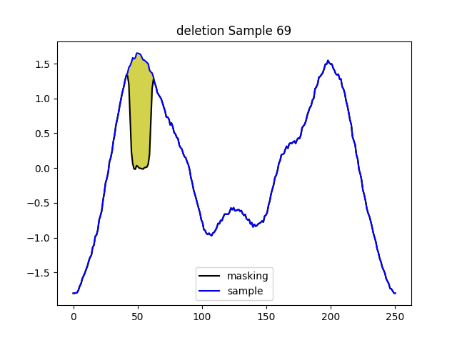
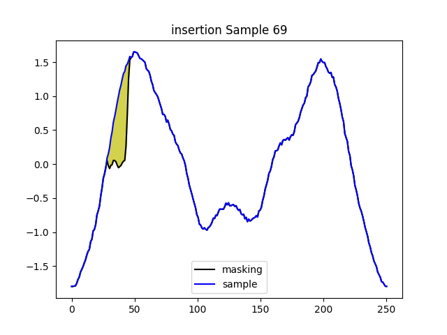
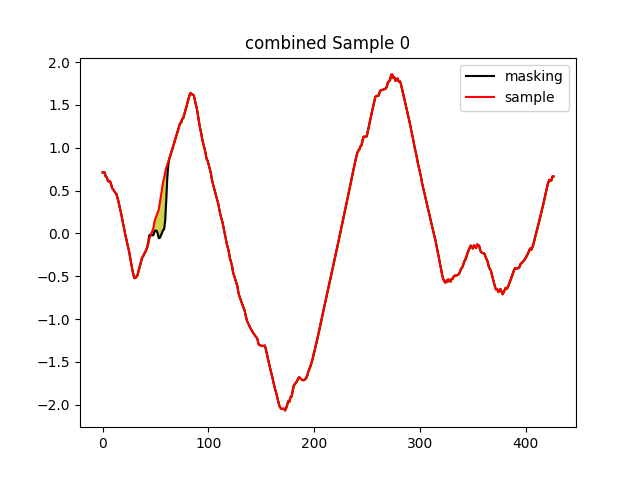
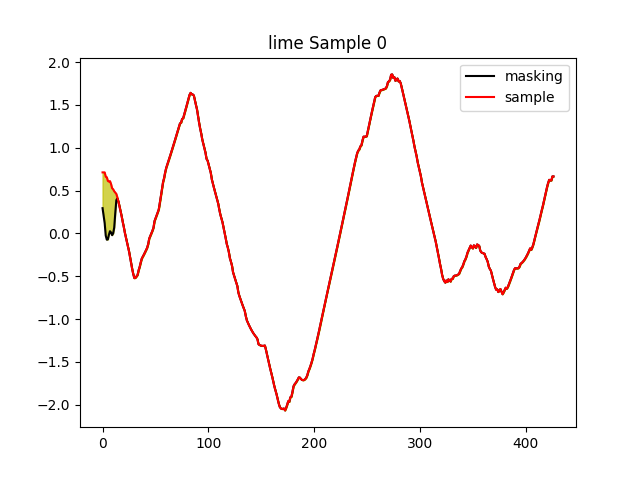
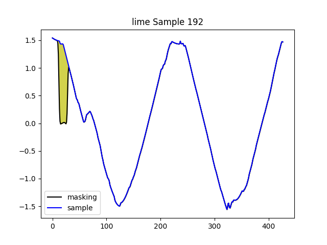
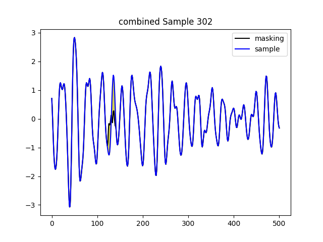
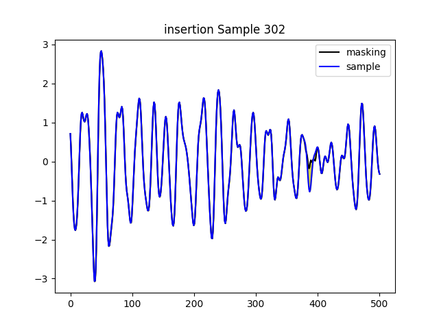

# Reviewer Gigm 

## [Q2.3] AUP and AUR Evaluations for Synthetic Dataset

|  | LIME | KernelSHAP | RISE | Insertion | Deletion | Combined |
|----------------------|----------|----------|----------|----------|----------|----------|
| AUP              | 0.489 &plusmn; 0.05   | 0.444 &plusmn; 0.06   | 0.391 &plusmn; 0.11   | 0.293 &plusmn; 0.08   | 0.467 &plusmn; 0.07   | **0.553 &plusmn; 0.10**   |
| AUR              | 0.431 &plusmn; 0.06   |  0.433 &plusmn; 0.07  | 0.330 &plusmn; 0.07   | 0.248 &plusmn; 0.06   | 0.427 &plusmn; 0.12   | **0.491 &plusmn; 0.04**  |

The average Area Under Precision (AUP) and Area Under Recall (AUR) are calculated for the synthetic dataset for all three models (LSTM, ResNet-34, Transformer). For AUP we measure the proportion of identified features that are indeed salient by evaluating if the predicted features up to rank k are included in th top-k ground-truth features. For AUR, it assesses the model's ability to cover the entire set of relevant features (as defined by the ground-truth) within its top-k prediction.

As shown in the table above, the AUP and AUR values of our proposed Combined method exceeds all other methods. This result can be inferred by the Rank-Biased Overlap (RBO) results, where the Combined method exceeds all other methods. We hypothesize that the RBO inherently includes aspects of both precision and recall due to its sensitivity to the order of features in the prediction and ground-truth (precision-like quality) and its sensitivity to the presence of features (recall-like quality) in the calculation. The AUP is greater than AUR for all methods, indicating the models are particularly good at placing relevant features high in their ranked predictions.    

---

## [Q2.4] Explanation sensitivity to hyperparameter alpha 

### Average faithfulness comparison of various alpha values in Time and Time-Frequency Domain for all datasets. Meand and standard deviation are shown across three classifiers. The boldface highlights the best performance in each domain.

|  | Time | Time-Frequency |
|----------------------|----------|----------|
| &alpha; = 0.8             | 0.115 &plusmn; 0.06   | 0.122 &plusmn; 0.06   |
| &alpha; = 0.5             | 0.131 &plusmn; 0.06   |  0.133 &plusmn; 0.05  |
| &alpha; = 0.2             | **0.147 &plusmn; 0.04**   |  **0.154 &plusmn; 0.08**  |

The alpha value indicates the insertion weight, and 1-alpha denotes the deletion weight according to equation 11 in the paper. The values above indicate mean and standard deviation for all nine UCR datasets using all three classifiers. The results show that decrease in the insertion weight and increase in the deletion weight increases the average faithfulness values for both time and time-frequency domain. The average faithfulness value is obtained by calculating the class probability change when inserting the most important feature into a baseline RBP data (insertion) or deleting the most important feature from original data (deletion). We hypothesize the reason higher deletion weight leads to better performance is because in the deletion method, the original data is within the model’s training distribution, and deleting a key feature effectively moves the data out of the training distribution leading to significant probability change. However, in the insertion method, the baseline RBP data is already outside the model’s training distribution, and inserting a key feature does not lead to drastic probability change by moving into the training distribution.

## [Q2.5] Explanation Samples

Explanation Samples from UCR repository datasets for better illustration

---

## Arrowhead Dataset

**Average of test samples in each class**

The above figure represents the average of all test samples in each class of the Arrowhead dataset. This figure is provided as reference for the example explanation samples given below.   

---

## Class 1 Explanation Sample 69

  
  
  
  
  
  

### Sample Explanation  

As denoted in the legend of each figure, **sample** represents the explanation sample and **masking** represents the inverse-STFT reconstructed signal after masking the most important feature from the time-frequency domain spectrogram. The most important feature is determined by each perturbation-based model stated in the title of each figure. The yellow-region represents the difference between the explanation sample and the masked reconstructed signal, which visualizes the effect of the important time-frequency feature.       

### Explanation Sample Comparison  

Although the average of each class does not indicate definite ground-truth important regions, a good class-specific explanation can be inferred by the distance between the class being explained to all other classes in the pinpointed region. Of the six different explanation figures above, the highlighted region of the combined method has the most distinct Class 1 region when referring to the average of each class. 

---

## Yoga Dataset

---

## Class 0 Explanation Sample 0

  
  
  
  
  
  

### Explanation Sample Comparison  

The important region of the combined method has the most distinct Class 0 region when referring to the average of each class of Yoga dataset.

## Class 1 Explanation Sample 192

  
  
  
  
  
  

### Explanation Sample Comparison  

The important region of the combined method has the most distinct Class 1 region when referring to the average of each class of Yoga dataset.

---

## Ford A Dataset

---

## Class 1 Explanation Sample 302

  
  
  
  
  
  

### Explanation Sample Comparison  

The Ford A dataset presents unique challenges in determining the optimal explanation through human perception because the class averages do not accurately show the distance between target class and other classes. Furthermore, the oscillation patterns in class 0 and class 1 are similar, leading to resemblances in their time-frequency characteristics. This similarity complicates the process of generating explanations based on time-frequency features. We provide explanation samples from each method above, but it is difficult to distinguish optimal important features with only human perception.   
