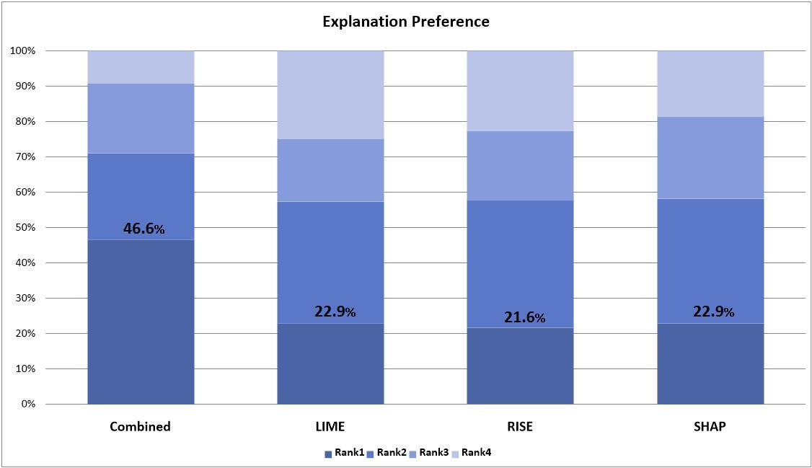
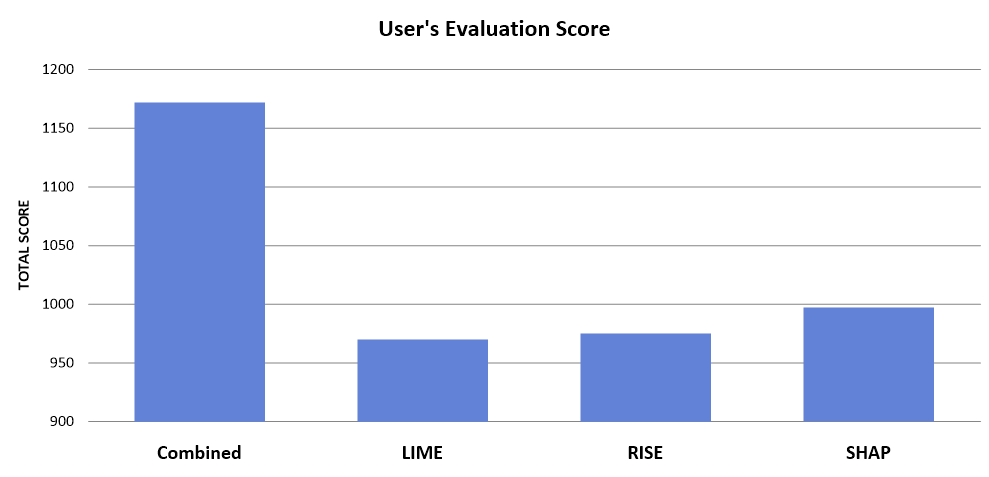

# Reviewer Ves3 

## [b] Insufficiency of Human Evaluation

### Explanation Preference

In order to strengthen our case of establishing the fairness of the ranking in explanation quality between our FIA combined method and other perturbation methods, we increased the number of evaluators from **six to twenty** graduate students studying machine learning. The results of this human evaluation indicates explanations produced by our method maintains superior ranking compared to other baseline methods despite increase in evaluators. The plot of human evaluation results is shown below:   

Here, the rank-1 percentage increased for our Combined method from 42.9% to 46.6%, whereas LIME and SHAP rank-1 percentage tied in second place with 22.9%, and finally RISE rank-1 percentage was 21.6%. Compared to previous human evaluation with six graduate students, rank-1 percentage of LIME increased from 19.3% to 22.9%, RISE increased from 21.1% to 21.6%, and SHAP decreased from 25.4% to 22.9%.

### Total Evaluation Scores

The total user's evaluation scores are also calcuated by allocating 4 points for rank-1, 3 points for rank-2, 2 points for rank-3, and 1 point for rank-4. Note when conducting the user study we allowed equal rankings for two or more methods. The total user's evaluation scores are shown below: 

The total score of our combined method is 1172 points, the total score of SHAP is 997 points, the total score of RISE is 975 points, and finally the total score of LIME is 970 points. 

---

## [g] Adjusting the window size and hop size 

### Window size of 64, overlap size of 32

|  | @1 | @2 | @4 | @6 | @8 |
|----------------------|----------|----------|----------|----------|----------|
| LIME                | **0.064 &plusmn; 0.04**   | 0.098 &plusmn; 0.08   | 0.291 &plusmn; 0.09   | 0.577 &plusmn; 0.03   | 0.688 &plusmn; 0.05   |
| KernelSHAP                | 0.059 &plusmn; 0.06   | 0.104 &plusmn; 0.07  | 0.295 &plusmn; 0.08   | 0.541 &plusmn; 0.06   | 0.653 &plusmn; 0.07   |
| RISE                | 0.062 &plusmn; 0.08   | 0.092 &plusmn; 0.08  | 0.274 &plusmn; 0.09  | 0.562 &plusmn; 0.09  | 0.671 &plusmn; 0.07   |
| Insertion                | 0.055 &plusmn; 0.09   | 0.101 &plusmn; 0.06  | 0.291 &plusmn; 0.05  | 0.560 &plusmn; 0.06  | 0.647 &plusmn; 0.04   |
| Deletion                | 0.062 &plusmn; 0.06   | 0.105 &plusmn; 0.07  | **0.313 &plusmn; 0.06**  | 0.575 &plusmn; 0.05  | 0.683 &plusmn; 0.08   |
| Combined                | 0.060 &plusmn; 0.05   | **0.108 &plusmn; 0.05**  | 0.308 &plusmn; 0.08  | **0.583 &plusmn; 0.04** | **0.691 &plusmn; 0.06**   |

### Window size of 128, overlap size of 64

|     | @1              | @2              | @4              | @6              | @8              |
|------------|-----------------|-----------------|-----------------|-----------------|-----------------|
| LIME       | 0.155 ± 0.02    | **0.340 ± 0.06**| 0.508 ± 0.03    | 0.681 ± 0.02    | 0.810 ± 0.07    |
| KernelSHAP | 0.150 ± 0.01    | 0.332 ± 0.04    | 0.502 ± 0.04    | 0.695 ± 0.04    | 0.834 ± 0.05    |
| RISE       | 0.151 ± 0.02    | 0.328 ± 0.06    | 0.496 ± 0.02    | 0.674 ± 0.04    | 0.818 ± 0.06    |
| Insertion  | 0.148 ± 0.01    | 0.325 ± 0.05    | 0.485 ± 0.03    | 0.659 ± 0.05    | 0.802 ± 0.04    |
| Deletion   | 0.153 ± 0.02    | 0.336 ± 0.06    | 0.514 ± 0.05    | 0.703 ± 0.07    | 0.842 ± 0.03    |
| Combined   | **0.159 ± 0.02**| 0.332 ± 0.03    | **0.524 ± 0.04**| **0.725 ± 0.04**| **0.855 ± 0.04**|
